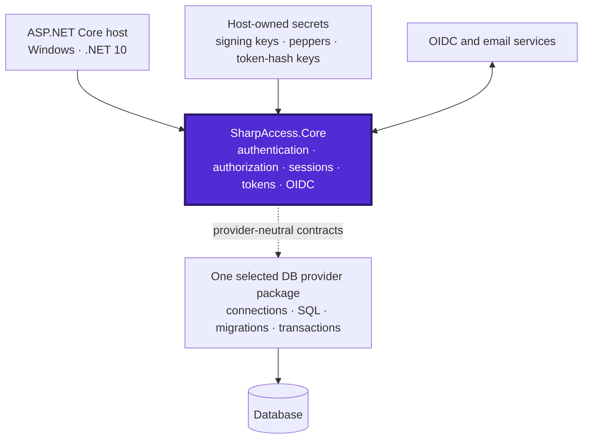
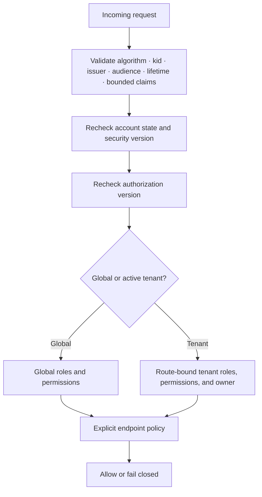
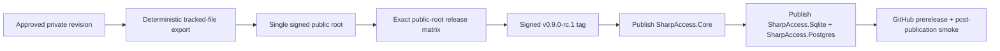

<div align="center">

# SharpAccess

### Provider-agnostic authentication and authorization for ASP.NET Core on .NET 10

**JWT access tokens · rotating refresh tokens · Argon2id · OpenID Connect · multi-tenant RBAC · direct asynchronous ADO.NET**

[](https://www.nuget.org/packages/SharpAccess.Core)
[](https://www.nuget.org/packages/SharpAccess.Sqlite)
[](https://www.nuget.org/packages/SharpAccess.Postgres)

[](https://dotnet.microsoft.com/)
[](#platform-contract)
[](LICENSE)
[](https://github.com/JonatanCordoba/SharpAccess/releases/tag/v0.9.0-rc.1)
[](https://github.com/JonatanCordoba/SharpAccess/actions/workflows/release-candidate.yml)

[Start in five minutes](#five-minute-setup) ·
[Architecture](#architecture) ·
[Security](#security-model) ·
[Engineering evidence](#release-quality-snapshot) ·
[Technical Wiki](https://github.com/JonatanCordoba/SharpAccess/wiki) ·
[Public API](docs/PUBLIC-API.md)

</div>

> [!IMPORTANT]
> **Release candidate:** `0.9.0-rc.1` is for evaluation and integration testing. Stable `1.0.0` is a later, separately gated release.

SharpAccess is a Windows-only authentication and authorization package family for ASP.NET Core and .NET 10. It keeps security behavior in **`SharpAccess.Core`** and lets the host select exactly one supported relational persistence package.

It is designed for teams that want explicit security boundaries, deterministic migrations, bounded resource use, provider-neutral application code, exact-revision engineering evidence, and a small reviewed public API—without adopting an ORM, ASP.NET Identity, or a hidden application framework.

## At a glance

| Audience | What to inspect first |
|---|---|
| Recruiters and engineering leaders | [Architecture](#architecture), [security model](#security-model), [quality snapshot](#release-quality-snapshot), and [release integrity](#release-integrity). |
| Application engineers | [Five-minute setup](#five-minute-setup), [package selection](#packages), and the [Configuration Reference](https://github.com/JonatanCordoba/SharpAccess/wiki/Configuration-Reference). |
| Security reviewers | [Security model](#security-model), `SECURITY.md`, cryptography, OIDC, mutation, and supply-chain pages in the Wiki. |
| Operators | Platform contract, migrations, observability, recovery, capacity, and release runbooks in the Wiki. |
| Contributors | `CONTRIBUTING.md`, quality gates, provider contracts, public API baselines, and exact-revision verification. |

## Why SharpAccess

| Capability | Engineering contract |
|---|---|
| Authentication | Password sign-in, registration, email verification, reset, account-state validation, and fresh-authentication checks. |
| Sessions | Rotating opaque refresh tokens, replay detection, family revocation, bounded active families, and transactional audit evidence. |
| Authorization | Separate global and tenant roles/permissions, active-tenant binding, immutable tenant ownership, and stale-context invalidation. |
| Tokens | Rotatable access-token signing keys, keyed hashes for opaque tokens, bounded claims, issuer/audience/lifetime validation, and fail-closed `kid` handling. |
| OpenID Connect | Generic keyed providers, Authorization Code + PKCE, nonce/state validation, exact issuer/algorithm checks, endpoint allowlists, and one-time local exchange. |
| Persistence | Provider-neutral Core with direct asynchronous parameterized ADO.NET in the selected DB package. |
| Security | Argon2id, versioned peppers, bounded hashing concurrency, sanitized failures, CSRF controls, atomic security mutations, and explicit host-owned secrets. |
| Engineering | Windows/PowerShell-only verification, provider contracts, critical mutation invariants, SBOMs, checksums, recovery drills, and an offline deterministic quality report. |

## Architecture

`SharpAccess.Core` is the primary node. The host selects one supported DB package; Core never references a concrete database client.



<details>
<summary><strong>Dependency rules</strong></summary>

- `SharpAccess.Core` owns provider-neutral behavior and contracts.
- Provider packages reference Core, but never one another.
- Provider-specific SQL, migrations, transactions, connection handling, and error classification remain internal.
- Production persistence uses asynchronous parameterized ADO.NET and propagates cancellation.
- The host owns transport, trusted proxies, Data Protection topology, secret storage, logging, monitoring, and the selected DB connection.

</details>

## Packages

Install **Core plus exactly one supported DB provider**.

| Package | Status | Role |
|---|---:|---|
| `SharpAccess.Core` | Supported | Provider-neutral authentication, authorization, tokens, OIDC, diagnostics, middleware, endpoint mapping, and host integration. |
| `SharpAccess.Sqlite` | Supported | Zero-infrastructure reference and local/runtime DB provider. |
| `SharpAccess.Postgres` | Supported | Server DB provider with real-engine, migration, recovery, concurrency, query-plan, and package evidence. |

<details open>
<summary><strong>Local or embedded DB package set</strong></summary>

```powershell
dotnet add package SharpAccess.Core --version 0.9.0-rc.1
dotnet add package SharpAccess.Sqlite --version 0.9.0-rc.1
```

</details>

<details>
<summary><strong>Server DB package set</strong></summary>

```powershell
dotnet add package SharpAccess.Core --version 0.9.0-rc.1
dotnet add package SharpAccess.Postgres --version 0.9.0-rc.1
```

</details>

> [!WARNING]
> Do not install or register both DB providers as primary persistence providers in the same host.

## Five-minute setup

```csharp
WebApplicationBuilder builder = WebApplication.CreateBuilder(args);

builder.Services.AddSharpAccess(builder.Configuration, options =>
{
    options.Features.PasswordAuthentication = true;
    options.Features.Registration = true;
    options.Features.PasswordReset = true;
    options.Features.RefreshTokens = true;
});

// Choose exactly one:
builder.Services.AddSqliteAccess(builder.Configuration);
// builder.Services.AddPostgresAccess(builder.Configuration);

WebApplication app = builder.Build();

await app.Services.InitializeSharpAccessAsync(
    app.Lifetime.ApplicationStopping);

app.UseSharpAccessExceptionHandling();
app.UseSharpAccessSecurityHeaders();
app.UseSharpAccess();
app.MapSharpAccessEndpoints();

await app.RunAsync();
```

<details>
<summary><strong>Minimal configuration</strong></summary>

```json
{
  "SharpAccess": {
    "BaseUri": "https://app.example.com",
    "JwtIssuer": "example-auth",
    "JwtAudience": "example-clients",
    "AccessTokenSigning": {
      "ActiveKeyId": "2026-08",
      "HmacSha256Keys": {
        "2026-08": {
          "Key": "<protected-secret>",
          "ActivatedUtc": "2026-08-01T00:00:00Z"
        }
      }
    },
    "TokenHashing": {
      "CurrentKeyVersion": "v1",
      "Keys": {
        "v1": "<protected-secret>"
      }
    },
    "Passwords": {
      "CurrentPepperVersion": "v1",
      "Peppers": {
        "v1": "<protected-secret>"
      }
    },
    "RateLimits": {
      "PartitionKey": "<dedicated-protected-secret>"
    },
    "Features": {
      "PasswordAuthentication": true,
      "Registration": true,
      "PasswordReset": true,
      "RefreshTokens": true,
      "Administration": false,
      "Tenancy": false
    }
  },
  "ConnectionStrings": {
    "Auth": "<host-owned DB connection string>"
  }
}
```

</details>

> [!CAUTION]
> Never commit signing keys, token-hashing keys, password peppers, rate-limit partition keys, OIDC credentials, Data Protection certificates, or DB connection strings.

## Security model



<details>
<summary><strong>Security properties</strong></summary>

- Argon2id passwords with random salts, versioned host-owned peppers, equivalent dummy work for unknown accounts, and bounded hashing capacity.
- Opaque refresh tokens; only keyed hashes are stored.
- Refresh rotation, replay detection, family revocation, security-version changes, and mandatory audit records are atomic where required.
- Global and tenant authorization are never flattened.
- Tenant claims must match the route-bound active tenant.
- OIDC uses Authorization Code + PKCE, nonce, state, exact issuer/algorithm checks, endpoint host allowlists, and one-time local exchange.
- Provider failures map to bounded provider-neutral categories; secrets and raw tokens are not logged.

</details>

## Release quality snapshot

The following block is generated from the exact release revision’s `artifacts/quality-report/metrics.json`. It must not be manually edited.

<!-- SHARPACCESS_QUALITY_SNAPSHOT_START -->
**Source:** exact-revision `artifacts/quality-report/metrics.json` · **Schema:** 2 · **Enforcement:** EvidenceOnly

| Metric | p95 | Worst observed | Aggregate / release interpretation |
|---|---:|---:|---|
| Line coverage | 100.00% | 0.00% minimum | 91.39% repository aggregate |
| Branch coverage | 100.00% | 0.00% minimum | 81.99% repository aggregate |
| CRAP score | 12.14 | 25.48 maximum | Executable methods only |
| Cyclomatic complexity | 8 | 24 maximum | Roslyn source metrics |
| Maintainability index | 100 | 41 minimum | Higher is better |
| Class coupling | 15 | 49 maximum | Distinct referenced types |
| Afferent coupling (Ca) | 11.6 | 13 maximum | Project + namespace units |
| Efferent coupling (Ce) | 8 | 9 maximum | Project + namespace units |
| Instability | 1.000 | 1.000 maximum | `Ce / (Ca + Ce)`; informational |
| Critical mutation invariants | N/A | **0 survived; 0 infrastructure failures required** | Binary per selected invariant; release tier must pass |

<details>
<summary>Scope and percentile notes</summary>

- Coverage percentiles are calculated across matched executable production members in `SharpAccess.Core`, `SharpAccess.Sqlite`, and `SharpAccess.Postgres`.
- The repository aggregate remains the release coverage score; the minimum exposes the worst observed member because coverage is higher-is-better.
- CRAP, cyclomatic complexity, maintainability index, and class-coupling statistics use the report's exact member dataset.
- Ca, Ce, and instability are calculated across project and namespace dependency units.
- Mutation invariants are binary and therefore do not have a meaningful p95.
- Consult `artifacts/quality-report/index.html` and `metrics.json` for complete project, namespace, type, member, dependency, and hotspot detail.

</details>
<!-- SHARPACCESS_QUALITY_SNAPSHOT_END -->

For higher-is-better metrics such as coverage and maintainability, the table reports p95 and the **minimum** as the worst observed value. For adverse metrics such as CRAP, cyclomatic complexity, coupling, and instability, the worst value is the **maximum**. Critical mutation evidence is binary, so a percentile is not meaningful: every selected critical mutation must be killed, with zero infrastructure failures.

The complete report includes project, namespace, type, member, dependency, and hotspot views. See [Quality and Metrics](https://github.com/JonatanCordoba/SharpAccess/wiki/Quality-and-Metrics).

## Platform contract

- Windows only.
- .NET 10 SDK selected by `global.json`.
- PowerShell 7 for repository automation.
- No Bash parity, Linux/macOS support claim, Dockerfile, Compose file, service container, or local container orchestration.
- External DB evidence uses native Windows tooling or an approved managed scratch DB.
- Hosts must validate their own deployment topology, availability, capacity, backups, monitoring, and disaster-recovery objectives.

## Documentation

| Start here | Deep technical reference |
|---|---|
| [Wiki Home](https://github.com/JonatanCordoba/SharpAccess/wiki) | [Architecture](https://github.com/JonatanCordoba/SharpAccess/wiki/Architecture) |
| [Getting Started](https://github.com/JonatanCordoba/SharpAccess/wiki/Getting-Started) | [Configuration Reference](https://github.com/JonatanCordoba/SharpAccess/wiki/Configuration-Reference) |
| [Package and DB Selection](https://github.com/JonatanCordoba/SharpAccess/wiki/Database-Providers) | [Authentication and Sessions](https://github.com/JonatanCordoba/SharpAccess/wiki/Authentication-and-Sessions) |
| [Security and Privacy](https://github.com/JonatanCordoba/SharpAccess/wiki/Security-and-Privacy) | [Authorization and Tenancy](https://github.com/JonatanCordoba/SharpAccess/wiki/Authorization-and-Tenancy) |
| [Operations and Recovery](https://github.com/JonatanCordoba/SharpAccess/wiki/Operations-and-Recovery) | [Testing and Verification](https://github.com/JonatanCordoba/SharpAccess/wiki/Testing-and-Verification) |
| [Quality and Metrics](https://github.com/JonatanCordoba/SharpAccess/wiki/Quality-and-Metrics) | [Release and Supply Chain](https://github.com/JonatanCordoba/SharpAccess/wiki/Release-and-Supply-Chain) |

## Release integrity

The public repository begins with one signed root commit containing the exact tracked tree exported from an approved private development revision. It does not inherit private commits, branches, tags, notes, issues, pull-request refs, or Git objects.

Packages, symbols, SBOMs, checksums, provenance, the signed `v0.9.0-rc.1` tag, and the GitHub prerelease are created only from the exact verified public release revision.



## Roadmap

SQL Server and MySQL remain roadmap candidates only. They are not active projects, packages, registrations, APIs, tests, workflows, or support commitments.

## License

SharpAccess is licensed under the [MIT License](LICENSE).
