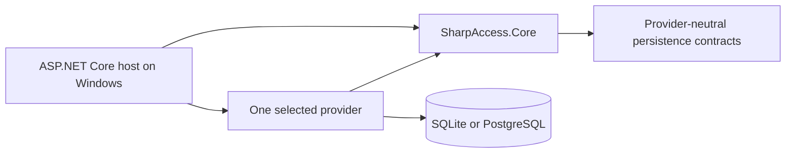
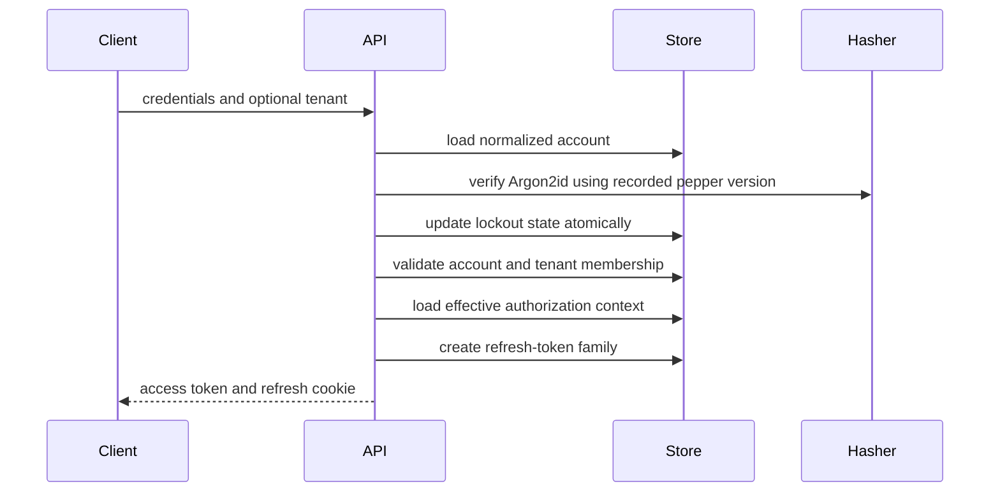

# Architecture

## Direction

SharpAccess is a Windows-only .NET 10 authentication and authorization package family.

- `SharpAccess.Core` owns provider-neutral behavior and contracts.
- `SharpAccess.Sqlite` owns the supported zero-infrastructure persistence implementation.
- `SharpAccess.Postgres` owns the supported initial server-provider implementation.
- `providers/Shared` contains only mechanically identical internal registration mappings linked into active provider assemblies.

SQL Server and MySQL are not active projects. They remain future roadmap candidates only.



## Dependency rules

- Core does not reference a concrete database client.
- Provider projects reference Core but not one another.
- The sample references Core and SQLite only.
- Provider-specific SQL, migrations, schema, transactions, error classification, and connection handling remain in the provider project.
- Production persistence uses asynchronous parameterized ADO.NET and propagates `CancellationToken`.
- No Bash, container, Linux, or macOS implementation boundary exists.

## Repository structure

```text
src/SharpAccess.Core/
  Abstractions/
  Attributes/
  Authorization/
  Configuration/
  Diagnostics/
  Domain/
  Endpoints/
  Extensions/
  OAuth/
  Persistence/
  Security/
  Services/
  Tokens/

providers/Shared/
providers/SharpAccess.Sqlite/
providers/SharpAccess.Postgres/
  Configuration/
  DependencyInjection/
  Persistence/
    Connections/
    Commands/
    Dialect/
    Schema/
    Transactions/
  Migrations/
  Stores/
  Internal/
  Properties/
```

Physical directories clarify ownership but do not define public API.

## Persistence and connection ownership

SharpAccess supports a shared application database or dedicated authentication database. Each provider owns `auth_schema_migrations`, all `auth_*` objects, SQL, transactions, and error classification.

Providers may create logical connections from a configured connection string or host-managed data source/factory. The host owns reusable pools and sources. SharpAccess opens or receives one logical connection per operation and disposes that logical connection; it does not dispose a captured host-owned source.

Application services depend on responsibility-specific persistence interfaces. `IAuthStore` remains a composition boundary, not a general application dependency.

## Authentication and sessions



Unknown accounts perform equivalent dummy Argon2id work. Refresh rotation, previous-token revocation, reuse detection, and family revocation are transactional.

## Authorization

Global and tenant authorization are separate domains. Provider-neutral contracts return separate global and tenant contexts inside `EffectiveAuthorizationContext`. Tenant joins always include `tenant_id`.

JWTs use distinct global and tenant claims. Validation rechecks account state, security version, authorization version, and active tenant membership. Tenant claims cannot satisfy global administrator policies.

Tenant ownership is a unique persisted row plus an immutable tenant `Owner` role. Transfer locks the current owner state, validates the new owner membership, moves ownership and roles atomically, invalidates affected sessions/contexts, and records audit evidence.

## Middleware boundary

The host configures trusted proxies, HTTPS/HSTS, CORS, Data Protection, logging, and monitoring. `UseSharpAccess` installs the package’s exception, security-header, cookie-confirmation, rate-limit, authentication, fresh-authentication, and authorization middleware in the documented order.

## Testing boundaries

- Unit: configuration, security, authorization metadata, JWT, OIDC, services.
- Integration: application flows against SQLite.
- Endpoint: public HTTP behavior and policy enforcement.
- Provider contracts: common SQLite/PostgreSQL persistence behavior.
- Package tests: public surface, identity, Windows topology, provider status, documentation, and release controls.

## Failure boundary

Database, HTTP, email, migration, and service I/O propagates cancellation. Expected failures map to bounded public errors. Unexpected exceptions remain server-side and return sanitized problem details. Provider rollback failures must not replace the original exception.