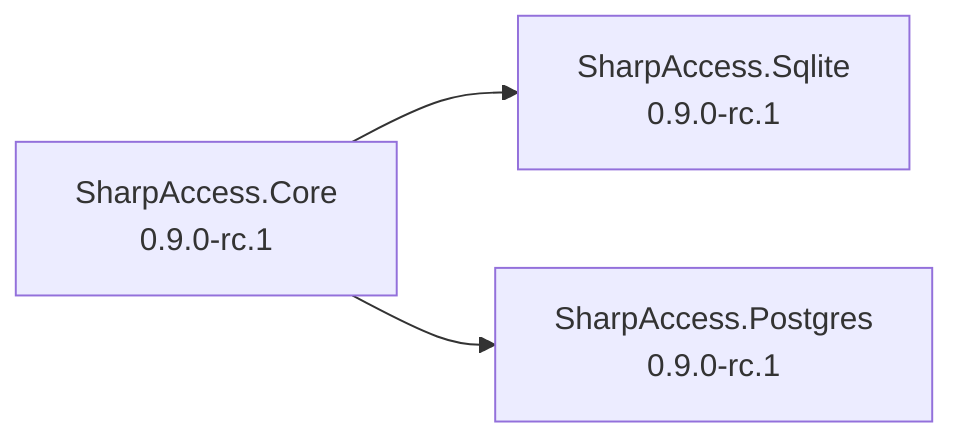

# NuGet packaging and publication

## Current prerelease artifacts

The ordinary development pack path produces synchronized prerelease artifacts for:

- `SharpAccess.Core`;
- `SharpAccess.Sqlite`;
- `SharpAccess.Postgres`.

SQL Server and MySQL are not active projects or package targets.

`eng/Version.props` owns the synchronized package version. The current release-candidate version is `0.9.0-rc.1`. Stable-looking artifacts remain forbidden outside the protected SharpAccess release workflow.

## Create local evidence packages

Run on Windows with PowerShell 7:

```powershell
./scripts/pack.ps1 -RepositoryRoot $PWD
```

The pack path runs the applicable verification and creates runtime `.nupkg` and symbol `.snupkg` packages only for entries marked `Supported` in `eng/ProviderStatus.props`.

Local artifacts are evidence only. Public NuGet release-candidate and stable packages are published only from the exact verified SharpAccess release revision.

## Consumer setup

After public packages are published:

```powershell
dotnet add package SharpAccess.Core --version 0.9.0-rc.1

# Choose exactly one supported DB provider:
dotnet add package SharpAccess.Sqlite --version 0.9.0-rc.1
# or:
dotnet add package SharpAccess.Postgres --version 0.9.0-rc.1
```

Register `AddSharpAccess` and exactly one supported provider, initialize after building the host, call `UseSharpAccess`, and map endpoints.

Do not register SQLite and PostgreSQL together as primary persistence providers.

## Public package badges

The public README displays one prerelease badge per package:

```markdown
[](https://www.nuget.org/packages/SharpAccess.Core)
[](https://www.nuget.org/packages/SharpAccess.Sqlite)
[](https://www.nuget.org/packages/SharpAccess.Postgres)
```

The badges become authoritative only after nuget.org indexes the published RC packages.

## Package surface rules

- Core does not reference a concrete database provider.
- Active provider projects reference Core but not one another.
- A supported provider exposes only its approved options and registration surface.
- A provider that is not Supported does not export supported host registration or ordinary package artifacts.
- SQL, migrations, stores, connection factories, dialects, transaction managers, and error classifiers remain internal.
- SQL Server/MySQL package IDs and namespaces are absent from the active source tree.
- Packable projects generate XML documentation and include the package README.
- Runtime and symbol packages use the same package ID and synchronized version.
- NuGet.org symbol publication uses the `.snupkg` format and portable PDBs.

## Public release-candidate publication

`0.9.0-rc.1` is generated only from the verified signed root revision in `JonatanCordoba/SharpAccess` after:

- the exact root revision passes the Windows release-candidate gate;
- PostgreSQL continuing real-engine evidence passes;
- protected OIDC and approved controlled-performance evidence pass;
- package contents and public API are reviewed;
- package-consumer validation passes for Core, SQLite, and PostgreSQL;
- SBOMs, checksums, provenance, package hashes, and signing evidence are retained;
- the exact root is tagged with the signed `v0.9.0-rc.1` tag;
- separate explicit authorization covers the tag and public package publication.

The GitHub release must be marked prerelease. It must not be marked as the latest stable release.

## Trusted Publishing

Use nuget.org Trusted Publishing with GitHub Actions OIDC instead of storing a long-lived NuGet API key.

The nuget.org policy must be bound to:

- repository owner: `JonatanCordoba`;
- repository: `SharpAccess`;
- the exact reviewed publication workflow file name;
- protected GitHub environment: `nuget-release`;
- the nuget.org individual or organization that owns all three package IDs.

The publication job requires only the permissions it needs:

```yaml
permissions:
  contents: read
  id-token: write
```

The `NuGet/login` action exchanges the GitHub OIDC token for a temporary NuGet API key. Request that key immediately before publication because it is short-lived. Supply the nuget.org profile name, not an email address.

Every action in the release workflow must be pinned to a reviewed full commit SHA. Do not enable a floating `NuGet/login@v1` reference merely because the official example uses that tag.

## Publication order

Publish the dependency first:



Required runtime package order:

1. `SharpAccess.Core.0.9.0-rc.1.nupkg`;
2. `SharpAccess.Sqlite.0.9.0-rc.1.nupkg`;
3. `SharpAccess.Postgres.0.9.0-rc.1.nupkg`.

Keep each package's matching `.snupkg` beside the runtime package. `dotnet nuget push` publishes the matching symbol package when present unless `--no-symbols` is supplied.

Use the NuGet V3 source:

```text
https://api.nuget.org/v3/index.json
```

## Verified push pattern

The publication workflow must first verify:

- the checkout is the exact signed tag target;
- the working tree is clean;
- exactly three runtime and three symbol packages exist;
- every package version is `0.9.0-rc.1`;
- package hashes match retained release evidence;
- repository/Source Link metadata points to `JonatanCordoba/SharpAccess`;
- package contents and dependencies match the reviewed cohort.

Then publish one runtime package at a time in dependency order:

```powershell
$env:NUGET_API_KEY = '<temporary-key-from-trusted-publishing>'
$source = 'https://api.nuget.org/v3/index.json'

$packages = @(
    'SharpAccess.Core.0.9.0-rc.1.nupkg',
    'SharpAccess.Sqlite.0.9.0-rc.1.nupkg',
    'SharpAccess.Postgres.0.9.0-rc.1.nupkg'
)

foreach ($package in $packages) {
    dotnet nuget push $package `
      --source $source `
      --timeout 600

    if ($LASTEXITCODE -ne 0) {
        throw "NuGet publication failed for $package."
    }
}
```

The selected .NET SDK supports the `NUGET_API_KEY` environment variable, avoiding exposure of the temporary key in command arguments.

Do not use `--skip-duplicate` for the first canonical publication. An existing package ID/version is a release-integrity failure that must stop the cohort and be investigated.

Do not continue to provider packages if Core publication fails.

## Post-publication validation

After nuget.org accepts the three packages:

1. wait for package and symbol validation/indexing;
2. confirm all three package pages show `0.9.0-rc.1` as a prerelease;
3. confirm README, license, repository URL, Source Link, dependencies, and symbols;
4. confirm the three README badges resolve to the RC version;
5. restore from nuget.org in clean .NET 10 consumer projects;
6. run Core plus SQLite smoke;
7. run Core plus PostgreSQL smoke against an approved scratch DB;
8. retain exact downloaded package hashes and consumer-smoke evidence;
9. create or finalize the GitHub prerelease assets and notes.

## Stable publication

Stable `1.0.0` remains a separate post-RC release. It requires dispositioned RC feedback and a fresh exact-revision run of every stable-release gate. The canonical stable tag is `v1.0.0` in `JonatanCordoba/SharpAccess`.

Provider source layout is not public API. File moves do not expand the package surface or change support status.
