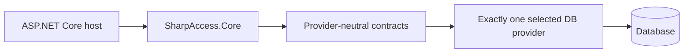

# Architecture

`SharpAccess.Core` is provider-neutral. Provider packages reference Core, but Core never references a concrete database client.

## Dependency rules

- Core owns authentication, authorization, sessions, tokens, OIDC, diagnostics, middleware, endpoint mapping, and provider-neutral contracts.
- Provider packages own SQL, migrations, transactions, connection handling, query behavior, and provider-specific error classification.
- Provider packages never reference one another.
- Production persistence uses asynchronous parameterized ADO.NET and propagates cancellation.
- The host owns transport, proxies, secrets, Data Protection, logging, monitoring, and the connection.

## Security boundaries

Authentication state and authorization state are rechecked against persisted data. Global and tenant authorization remain separate. Provider mutations that require canonical audit evidence perform the mutation and transaction-local audit insert atomically.

## Persistence boundary

The host chooses SQLite or PostgreSQL. A host-managed connection factory retains ownership of physical connection policy while SharpAccess preserves its logical transaction and validation contracts.

## Repository structure

- `src/SharpAccess.Core`: provider-neutral package.
- `providers/SharpAccess.Sqlite`: SQLite package.
- `providers/SharpAccess.Postgres`: PostgreSQL package.
- `tests`: unit, integration, endpoint, package, and provider-contract suites.
- `scripts`: PowerShell-only verification and release tooling.
- `eng`: centralized version, provider, quality, complexity, release, and supply-chain policy.

## More detail

- [Architecture reference](https://github.com/JonatanCordoba/SharpAccess/blob/main/docs/ARCHITECTURE.md)
- [Provider boundaries](https://github.com/JonatanCordoba/SharpAccess/blob/main/docs/architecture/provider-boundaries.md)
- [Database providers](https://github.com/JonatanCordoba/SharpAccess/blob/main/docs/DATABASE-PROVIDERS.md)
- [Persistence and connection ownership](https://github.com/JonatanCordoba/SharpAccess/blob/main/docs/PERSISTENCE-AND-CONNECTIONS.md)
