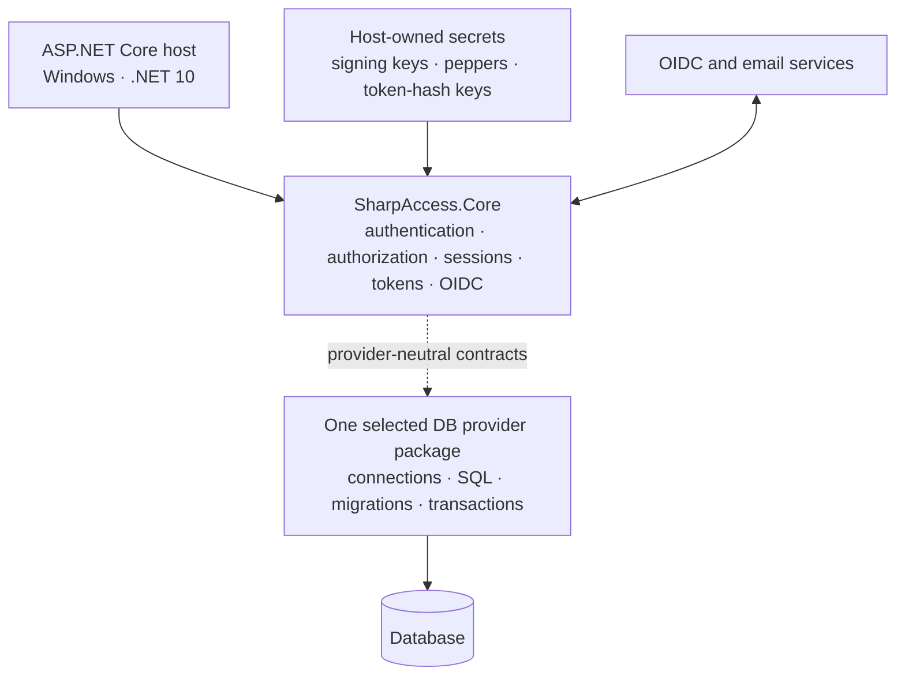

# SharpAccess Wiki

SharpAccess is a Windows-only authentication and authorization package family for ASP.NET Core on .NET 10. Security behavior lives in `SharpAccess.Core`; the host selects exactly one supported relational persistence package.

> [!IMPORTANT]
> `0.9.0-rc.1` is a release candidate for evaluation and integration testing. Stable `1.0.0` is a later, separately gated release.

> [!NOTE]
> The repository is preparing `0.9.0-rc.1`. Until the signed tag, GitHub prerelease, and NuGet package pages exist, installation commands in this Wiki are prospective release instructions rather than proof that the packages are available.

## Package family

| Package | Status | Purpose |
|---|---:|---|
| `SharpAccess.Core` | Supported | Authentication, authorization, sessions, JWT access tokens, OpenID Connect, diagnostics, middleware, endpoints, and provider-neutral contracts. |
| `SharpAccess.Sqlite` | Supported | Zero-infrastructure reference and local/runtime DB provider. |
| `SharpAccess.Postgres` | Supported | Server DB provider with native Windows evidence for contracts, migrations, recovery, concurrency, query plans, and packaging. |

Install Core plus exactly one provider. SQL Server and MySQL are roadmap candidates only; they are not active packages, projects, registrations, workflows, or support commitments.

## Start here

- [Installation](Installation)
- [Quick Start](Quick-Start)
- [Configuration](Configuration)
- [Architecture](Architecture)
- [Authentication](Authentication)
- [Authorization](Authorization)
- [Tokens and Refresh](Tokens-and-Refresh)
- [OpenID Connect](OIDC)
- [SQLite Provider](SQLite-Provider)
- [PostgreSQL Provider](PostgreSQL-Provider)
- [Database Migrations](Database-Migrations)
- [Operations](Operations)
- [Recovery](Recovery)
- [Security](Security)
- [Quality and Metrics](Quality-and-Metrics)
- [Performance and Capacity](Performance-and-Capacity)
- [Troubleshooting](Troubleshooting)
- [Roadmap](Roadmap)
- [Contributing](Contributing)

## Platform contract

- Windows only.
- .NET 10 SDK selected by `global.json`.
- PowerShell 7 for repository automation.
- No Bash parity, Linux/macOS support claim, Dockerfile, Compose file, service container, or local container orchestration.
- External DB evidence uses native Windows tooling or an approved managed scratch DB.

## Architecture at a glance

The host owns transport, trusted proxies, Data Protection topology, secret storage, logging, monitoring, and the selected DB connection.

## Canonical references

- [Repository README](https://github.com/JonatanCordoba/SharpAccess/blob/main/README.md)
- [Documentation index](https://github.com/JonatanCordoba/SharpAccess/blob/main/docs/README.md)
- [Public API](https://github.com/JonatanCordoba/SharpAccess/blob/main/docs/PUBLIC-API.md)
- [Security policy](https://github.com/JonatanCordoba/SharpAccess/blob/main/SECURITY.md)
- [Support policy](https://github.com/JonatanCordoba/SharpAccess/blob/main/SUPPORT.md)
